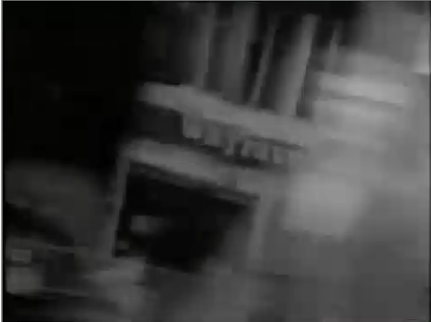

# Man About The House Edits

This is a guide comparing ITV Hub episodes with ones found on Dailymotion of unknown-but-probably-from-the-dvds provenance

## Methodology

As there are multiple copies of each episode on Dailymotion, I chose the longest one. This does mean that ITV Hub's apples aren't always being compared to other apples. some of the uploads are clearly from a DVD copy (they have Fremantle Media endcaps) and some are seemingly from VHS or older DVDs (they have Thames Colour Production endcaps). The ITV Hub ones all have Fremantle Media Enterprises endcaps.

## General Info

This run of the series from ITVHub were shown around 9:00am in the morning on ITV3. The repeats post-watershed at 3:00am ish were the same edits.

The main difference in whole video running times comes from the Dailymotion episodes having far, far longer 'End of Part One'/'Part Two' transitions. This is why there is also a measure of the episode lengths without the intro, break and credit sequences.

## Format

The times in the headings are the points of the ITV Hub versions where the cut occurs.

> This is dialog or actions which were cut
>
> This is still apart of the cut
>
> This is the end of the cut

Lines before and after the above are uncut lines to give a bit of context of where the cut is in addition to the timestamp.

* Sections like this are comments from me about the cut

## Where's S1?

By the time I thought about doing this, S1 had already expired off of ITV Hub. It'll be repeated at some point and if I remember, I'll probably update.

# S2E1 - While the Cat's Away

ITV: Tuesday, 7 Sept 2021, 9:05am  
Dailymotion source: johnurqhart - DVD? It has a Thames countdown board (I don't know the technical term) on the front of it and a Thames Colour Production endboard

## 1:35

Robin: We'll turn the telly off first  

> Jo: We will not. I quite fancy the one who plays the strong, silent sherrif.  
> Chrissy: Bent as a corkscrew  
> Jo: How do you know?  
> Chrissy: Well, I don't really. But someone has to start these vicious rumours  
> Robin: Actually you know, I've got my suspicions about that horse of his too  
> Chrissy: Right  

Jo: Well, if we're gonna have a running commentary, I might as well turn it off

## 7:07

Chrissy: Well that's 14 girls and 14 fellas so far  
Jo: Oh, great!  

> [Jo turns to the men behind her]  
> Jo: Maurice, we're having a party at out place tomorrow night, 8 o'clock. Can you and him come?  
> Maurice: Oh, super. [To Tom] I shall have to wash your hair  
> Tom: We do love a do  
> [Jo turns back to Chrissy]  
> Jo: OK, that's Maurice and Tom  
> Chrissy: I don't know which column to put them in  
> Jo: You'll have to make another one  

Barman: 6 bottles of red wine, 6 bottles of white and 10 eight-pint cans of bitter. And one packet of crisps

## 12:16
Jo: Well, it's the same colour  
Robin: Listen, what you need is a little fruit

> [Robin picks up two oranges]  
> Tom: Ooh, you spoke?  
> Robin: Alright Tom, Maurice  
> Maurice: Hello, that's a nice number you've got on  
> Robin: Thank you. I think yours is very nice too  
> Maurice: Ooh, ta  
> Robin: [to Jo] Listen, you haven't seen Liz have you  
> Jo: I don't know, what does she look like?  
> Robin: [looking at the oranges] Well she's sort of like...

Chrissy: Do you like my dress?

## 14:05

Robin: Come on, she's a very attractive lady. Every man in the party fancies her.

> [Maurice laughs in the background]  
> Robin: ...well, almost every man

Chrissy: I'm not surprised. I've seen higher necklines on a topless waitress

* As opposed to some cuts that have been made, this one is well hidden by replaying the end of the previous scene where Paul hands Lesley the martini

## 20:28

Mildred: Oh George, lets go. I mean, they never had parties like that when we were alive

> [Next scene]  
> Jo: Where did yo learn to do this Maurice?  
> Maurice: Well it's funny really. I first learned to do this in the Royal Marine commandos. Dead loss though, they never had any pride in their appearance, did they?  
> Tom: Then you went to Vidal's for a refresher, didn't you?  
> Maurice: Yeah, he taught me a lot  
> Jo: Oh you'll make someone a lovely brother  
> Maurice: Aw, you're only saying that because it's true

Robin: Er, Jo, you haven't seen the scotch have you?

## 21:47

Chrissy: Hey, don't feel bad. If anything had happened it would only have spoiled things  
Robin: You're absolutely right

> Robin: [effeminately] Listen, I wonder who's taking Maurice home?

Mildred: Would you believe it must've been six years since I last had a dance

* And that's that episode. The ITV Hub version almost entirely cuts out the character of Maurice, but as we'll see, almost any hint of homosexuality and it's cliches ends up like this

| ***Running times*** |
| Complete |
| Dailymotion | 24:57 |
| ITV Hub | 22:48 |
| Not including intro, break bumpers or credits |
| Dailymotion | 22:20 |
| ITV Hub | 20:48 |

# S2E2 - Colour Me Yellow

ITV: Wednesday, 8 Sept 2021, 9:05am  
Dailymotion source: Old ITV Hub download? It has the much longer break bumpers, classic Thames intro, but distributed by Freemantle Media endboard. The ITV hub download has a distributed by Freemantle Media Enterprises endboard

## 4:50

Mildred: Why don't you take an aspirin? Take two...

> Mildred: ...Take hundred  
> George: Yeah, you'd enjoy that wouldn't you? The merry widow  
> Mildred: Oh George, I was only joking

Mildred: Mind you, there is a very nice black coat in here

* Only one cut between these episode sources, and it both tramples on a joke and a callback later on.

| ***Running times*** |
| Complete |
| Dailymotion | 23:10 |
| ITV Hub | 22:42 |
| Not including intro, break bumpers or credits |
| Dailymotion | 20:45 |
| ITV Hub | 20:38 |

# S2E3 - In Praise of Older Men

ITV: Thursday, 9 Sept 2021, 9:10am  
Dailymotion source: Old ITV Hub download? It has the much longer break bumpers, classic Thames intro, but distributed by Freemantle Media endboard. The ITV hub download has a distributed by Freemantle Media Enterprises endboard

## 14:53

Chrissy: Which manual is that in?

> Robin: Now listen, I grant you. An elder man, he can be very attractive.  
> Chrissy: Ooh

Robin: I mean this business nonsense. Tou can't really believe it

## 22:40

Chrissy: That's it, that is it. I'm right off men. No more men. I'm finished with the lot of 'em  
Robin: Great...

> Robin: In the future, [Effeminitely] just think of me as one of the girls

Chrissy: Oh well, at least there's one good thing. If I had married him, I'd have had to go through life as Chrissy Cross.

| ***Running times*** |
| Complete |
| Dailymotion | 24:49 |
| ITV Hub | 24:13 |
| Not including intro, break bumpers or credits |
| Dailymotion | 22:21 |
| ITV Hub | 22:12 |

# S2E4 - Did You Ever Meet Rommel?

ITV: Friday, 10 Sept 9:10am  
Dailymotion source: 'Man About The House' channel

## 3:18

Chrissy: Yes, and you showed me your flannel full of shrapnel  
George: Always reckoned Hitler knew when it was bath night round our way...

> George: ... ruthless these krauts  
> Chrissy: Well that was a long time ago  
> George: No, don't change. Bad losers you see. You never get them celebrating the Battle of Britain day, do you?

Chrissy: Incedentally, I believe tomorrow is going to be quite a sepecial day for you

## 6:38

Jo: I don't really think we can invite anyone with the tablecloth looking like this

> [Scene change]  
> Robin: You know what'll happen if Franz and old Mr Roper sit at the same table don't you, eh? [Doing an impression of George] We crushed you krauts twice [laughs] We'll do it again

Chrissy: Look, couldn't you ask your friend another night?

## 10:46
George: Ah, great days them you know, the blitz.

> George: Krauts throwing everthing they had against us. One man stading between us and the jackboot of the hun. One man keeping us going. I don't know how we would've managed withot Tommy Handley.  
> Chrissy: But the Germans ae our friends now, aren't they?  
> George: No, they're Nazi's the lot of them. Mind you we thrashed them twice [laughs] We can do that again

Robin: So how long would it take to brick up the stairs?

## 15:04

Robin: You know Jo and Chrissy, and this is Mr and Mrs Roper  
Franz: Hi

> George: [does Hitler salute] Hi, er

George: Hello

## 16:37

Robin: Go on, take that one in

> [Scene change]  
> George: Course, they weren't all your Nazis.

George: Take Rommel for instance. He played fair.

## 18:54

Franz: If you'd have let us crush Poland in 1939

> Franz: You might've met us in this World Cup [Does Hitler salute] Sieg Heil!

Robin: What?

> Franz: Well that's how he expects all 'krauts' to behave isn't it?

Franz: He's been niggling away all night.

## 19:11

George: Then he built your autobahns

> Franz: They had nice uniforms  
> George: Right, and they nearly put the Ruskies in their place  
> Franz: Right, and your nothing but a bloody fascist  
> George: Yeah, eh? What?

Chrissy: How's about a nice little toast? Happy wedding anniversary

| ***Running times*** |
| Complete |
| Dailymotion | 22:52 |
| ITV Hub | 21:07 |
| Not including intro, break bumpers or credits |
| Dailymotion | 20:11 |
| ITV Hub | 19:05 |

## S2E5 - Two Foot Two, Eyes of Blue

ITV: Monday, 13 Sept 9:05am  
Dailymotion: Man About The House channel

## 15:17
Robin: Oh, she'll be alrght, there's nothing to it

> Chrissy: What?  
> Robin: Well I mean, in China you know, the women don't even straighten up from picking the rice. It's all splash, [does Chinese narrow eyes] ???  
> Chrissy: Oh yeah. And how would you feel if men had the babies  
> Robin: Terrified of being alone with you, ducky  
> Chrissy: [picks up telephone, to Robin] You are an unfeeling pig  
> [Scene change]  
> Mr Randall: Yes, yes, I know, but, hello

Mr Randall: Ah, Chrissy

* I can't quite work out what the joke is after Robin narrows his eyes but either way, this is the first of the awful cuts. Not because I'm married to 70's Chinese stereotypes, but the cut is handled by fading to black in the middle of the scene and coming back up after Chrissy answers the telephone

## 18:04

Chrissy: Get off!

> Robin: I will if you like, but when gay lib comes to me remember you're to blame dear.  
> Chrissy: You never give in  
> Robin: Neither do you  
> [Baby cries]  
> Robin: Oh no, not again. Look you're not going in are you?  
> Chrissy: Aww, he probably only wants a little cuddle  
> Robin: I know how he feels

[Scene change]  
Jo: I've had a lovely evening Phillip

* The first bit of this is in line with ITV's 'cut everything that revolves around homosexuality' policy that seems to have been employed, but on Robin's last line of the cut bit the camera moves up and back down as if somebody accidentally whacked it, which is probably why the cut is longer than it needs to be.

| ***Running times*** |
| Complete |
| Dailymotion | 25:26 |
| ITV Hub | 24:23 |
| Not including intro, break bumpers or credits |
| Dailymotion | 23:06 |
| ITV Hub | 22:25 |

# S2E6 - Carry Me Back To Old Southampton

ITV: Tuesday, 14 Sept 9:10am  
Dailymotion: Man About The House channel

* No cuts here

| ***Running times*** |
| Complete |
| Dailymotion | 24:22 |
| ITV Hub | 24:01 |
| Not including intro, break bumpers or credits |
| Dailymotion | 22:05 |
| ITV Hub | 22:05

# S3E1 - Cuckoo In The Nest

ITV: Wednesday, 15 Sept 9:05am  
Dailymotion: johnurquhart channel

## 9:01

Jo: Good idea, let's murder him!

> [Scene change]  
> George [looking through his dirty magazine]: Domino, swedish. [Turns page] Cor 17. [Turns page] Cor blimey.

[Knock on the door]  
George: Aah, err, hold on. Just a minute.

## 12:15

Robin: Now, what do you think?

> Larry: Bloody 'ell

Chrissy: You're not looking at the possibilities Larry

## 12:26

Robin: Just think about it  
Larry: I'm thinking about it

> Larry: Bloody 'ell

Larry: You just wanna get rid of me don'tcha?

* This is the first audio only cut we've seen. Larry's line has been muted but we still see his mouth move and the laugh afterward remains intact. The first 'Bloody 'ell' is awkwardly cut out as Chrissy then talks over a laugh that came out of nowhere, whereas this muting makes it looks like Larry is intentionally muttering under his breath and it works well

## 12:41

Robin: A... white painted crummy attic

> Chrissy: Whose side are you on?  
> [Jo enters]  
> Chrissy: Jo, you tell him. You can see the possibilities, can't you?  
> Jo: Bloody hell  
> Larry: There you are, see. She speaks her mind. She doesn't just want to get rid of me  
> Jo: Oh, yes I do  
> Larry: Oh, charming

Chrissy: That's gratitude for you. After all we'e done for you and that's the thanks we get.

## 13:20

Jo: I don't steal your makeup  
Chrissy: Well somebody does  
Robin: Alright, I admit it, it's me

> Robin: Read my shameful secrets in the News of the World

Chrissy [to Jo]: How about "you borrow them and never give them back"

## 22:38
* Each slide of the credits that names the actors is shown longer in the ITV version. This is because the credit for Mr Morris, the antiques dealer, is removed. It's removed because his credit slide contains five black and white pictures, the middle one being a completely topless woman. [https://www.aveleyman.com/TVEpisode.aspx?FilmID=210&Episode=19741009](At 8:27 on a Wednesday on ITV), blimey, the 70's really were permissive.

| ***Running times*** |
| Complete |
| Dailymotion | 24:49 |
| ITV Hub | 23:13 |
| Not including intro, break bumpers or credits |
| Dailymotion | 21:58 |
| ITV Hub | 21:21 |

# S3E2 - Come Into My Parlour

ITV: Thursday, 16 Sept 9:10am  
Dailymotion: johnurquhart channel

## 3:12

Robin: How terribly, terribly boring

> [Scene change]  
> Chrissy: Soup, er vinegar, tomato sauce  
> Robin: Hey listen, you haven't seen any fresh, whitstable oysters around have you?  
> Chrissy: No  
> Robin: Just as well, couldn't afford them anyway  
> Chrissy: Look, why don't you try lettuce? That's cheap. Rabbits do alright with it  
> Robin [reading cookbook]: Powdered bark?!  
> Robin [to shop assistant]: I know the answer before I ask the question, but you wouldn't by any chance have any powdered bark of the Yohimbe tree?  
> Shop assistant: If Birds Eye don't do it, we haven't got it

Chrissy: Hey, what's she like?

* This is a weird cut. If only because why? We've already seen the Sex Maniacs cookbook Robin is holding in the previous scene, he isn't doing his effeminate voice that gets other 'nothingy' bits cut and it's not the shop assistant as she's in the next scene. Is it solely the mention of Birds Eye?

## 4:08

* No dialogue is cut here, but frames are trimmed off of every shot. The first shot of Chrissy entering the pub waving her handbag starts five frames later in the ITV version. How weird.

## 9:40

* Again, no dialog is cut but the sequence of Robinin his bedroom is zoomed in to mask the a picture of a topless woman on his wall. The scene is also shorter, Robin giving a thumbs up to 'Love one another' sign on his wall is cut because with the zoomed in shot, we can't see his thumbs or the sign

## 16:15

* Instead of being zoomed in, a reprise of the above sequence is completely cut

## 23:22

* Like the previous episode, each slide of the acting credits is longer. The slide for the shop assistant is cut because of the topless lady.

| ***Running times*** |
| Complete |
| Dailymotion | 25:50 |
| ITV Hub | 23:57 |
| Not including intro, break bumpers or credits |
| Dailymotion | 23:02 |
| ITV Hub | 22:02 |

# S3E3 - I Won't Dance, Don't Ask Me

ITV: Friday, 17 Sept, 9:10am  
Dailymotion: johnurquhart channel

## 3:35

Robin: There are times when women's lib makes sense.

> Robin: Will you buy me some chocolates as well?  
> Chrissy: I might, as long as you let me get you in the shop doorway afterwards  
> [Robin giggles]

Robin: Yes, I knew it, you just want my body. don't you?

* It's been well estabished that 'Robin acts gay' and 'Robin acts as a woman' are #1 on the list of things to cut out. But even by those standards this is very benign. And it can hardly be for the oblique reference to sex, or each episode would be cut to about five minutes

## 13:23

Mildred: But this girl, he gives her up because of his love for all men

> Robin [effeminately]: Yes, I know the type  
> George: I tell you what...

George: I might come down to three quid

## 16:40

Chrissy: Hey listen, we're on the same table as Marjorie and Denise  
Robin: So, what's the matter with them?

> Chrissy: So, for one thing, they're the firms 'jungle drums'. Anything you say will taken down and used in the powder room  
> Robin: Let's give them something to gossip about, eh

Chrissy: No, see, they're both with their boyfriends. One's an architect and one's a chartered accountant

* This cut is masked by inserting the beginning of the next shot (the wide shot of the room) over the dialogue before going back to Robin and Chrissy

## 23:29

* As is becoming customary this series, the actors credit slides are on screen longer as the one with the topless lady is again cut out. This time the characters of Nigel and Stuart are the characters to lose their credit

| ***Running times*** |
| Complete |
| Dailymotion | 25:37 |
| ITV Hub | 24:15 |
|Not including intro, break bumpers or credits |
| Dailymotion | 22:42 |
| ITV Hub | 22:22 |

# S3E4 - Of Mice And Women

ITV: Monday, 20 Sept, 9:05am  
Dailymotion: deaddogsmoking channel

## 6:34

Mildred: I'll tell you when you're in a good mood  
George: I'm in a good mood!

> Mildred: Not good enough  
> George: I'm in as good a bloody mood as you're gonna get then! Now, why?

Mildred: My mother is coming on Monday to spend the week with us

## 23:40

* Curiously, to buck the trend of the previous episodes of this series, the principal actors credit slides aren't extended here. The slide with the topless woman and the credit for Larry's girlfriend remains intact (and unedited) on the ITVHub version

| ***Running times*** |
| Complete |
| Dailymotion | 24:52 |
| ITV Hub | 24:14 |
| Not including intro, break bumpers or credits |
| Dailymotion | 22:10 |
| ITV Hub | 22:04 |

# S3E5 - Somebody Out There Likes Me

ITV: Tuesday, 21 Sept, 9:05am  
Dailymotion: johnurquhart channel

## 4:06

Robin: The bells, the bells

> Chrissy: Oh, push off

Jo: Don't you like them?

* Somebody must have heard 'piss off' for this to be cut, but it does sound like 'push off' to me

## 18:02

Jo: Anyway, dust is nature's way of telling you to move about occasionally

> Robin: I tell you what, some day you'll make somebody a wonderful slut. [picks up phone] Hello

Alan: [VO] Hello, can I speak to Chrissy Plummer please?

| ***Running times*** |
| Complete |
| Dailymotion | 24:01 |
| ITV Hub | 22:58 |
| Not including intro, break bumpers or credits |
| Dailymotion | 21:12 |
| ITV Hub | 21:05 |

# S3E6 - We Shall Not Be Moved

ITV: Wednesday, 22 Sept, 9:05am  
Dailymotion: johnurquhart channel

## 12:29

Chrissy: Because we told Roper we'd be out by saturday. I mean, if you want to move in with his mother

> Robin: All right, all right, all right. Actually there is one here for three to share  
> Chrissy: Any good?  
> Robin: Well, I don't know.It's only twicce as much as we can afford  
> Chrissy: Well that's pretty good  
> Robin: [Dialling phone] Yeah, but you know, these old landladies are a bunch of old... Oh good evening Madam, I'm enquiring about the advertisement in the... Sorry, am I what? Suntanned? Erm, no, not very. [Feeling his hair] Er, it's straight. No, it's not frizzy. [To Chrissy] She wants to know if I've got frizzy hair!?  
> Chrissy: She wants to know if you're coloured but she's not allowed to ask  
> Robin: [Into phone] Well hush my mouth soul sista. I'm a whitey sho'nuff. And no cotton- She's hung up  
> Chrissy: C'mon, keep looking.

[Scene change]

## 18:37

Mildred: Good job I caught that early train. Oh hello dears. I'm sorry. I knew nothing about this...

> Mildred: Oh god. What's that little bugger been up to now?

[Scene change]

## 21:00

* At the end, the credit slide with the topless lady is once again included unedited. So the credit sequences are the same.

| ***Running times*** |
| Complete |
| Dailymotion | 23:27 |
| ITV Hub | 21:36 |
| Not including intro, break bumpers or credits |
| Dailymotion | 20:38 |
| ITV Hub | 19:44 |

# S3E7 - Three Of A Kind

ITV: Thursday, 23 Sept 9:05am  
Dailymotion: deaddogsmoking channel

No cuts

| ***Running times*** |
| Complete |
| Dailymotion | 24:16 |
| ITV Hub | 23:39 |
| Not including intro, break bumpers or credits |
| Dailymotion | 21:37 |
| ITV Hub | 21:37 |

# S4E1 - Home And Away

ITV: Friday, 24 Sept 9:05am  
Dailymotion: johnurquhart channel

## 13:51
[The bikers approach and go past the car]

> [Robin emphatically throws the V-sign and continues pushing the car until the end of the part]

* ITV cut to a black screen with the logo before the V-sign happens, removing the albeit limited payoff to this entire minute of nothing but car pushing

## 20:41
Robin: They're coming back  
[The bikers approach]

> Chrissy: Aren't those the ones you gave the V-sign to?  
> Robin: I think you're right

Robin: Look, if anything should happen...

* Topless lady credit slide: intact

| ***Running times*** |
| Complete |
| Dailymotion | 25:09 |
| ITV Hub | 24:39 |
| Not including intro, break bumpers or credits |
| Dailymotion | 22.47 |
| ITV Hub | 22:39 |

# S4E2 - One For The Road

ITV: Monday, 27 Sept 9:05am  
Dailymotion: johnurquhart channel

## 11:38
[Chrissy gets out the car and runs around to the back to see the damage]

> One second has been cut off the end of Chrissy's reaction

[In the police car]
Policeman: Did you see that Arthur?

* Topless lady credit slide: cut

| ***Running times*** |
| Complete |
| Dailymotion | 29:13 |
| ITV Hub | 28:48 |
| Not including intro, break bumpers or credits |
| Dailymotion | 26.57 |
| ITV Hub | 26:56 |

# S4E3 - All in the Game

ITV: Tuesday, 28 Sept 9:05am  
Dailymotion: deaddogsmoking channel

# S4E4 - Never Give Your Real Name

ITV: Wednesday. 29 Sept 9:05am  
Dailymotion: deaddogsmoking channel

# S4E5 - the Tender Trap

ITV: Thursday, 30 Sept 9:05am  
Dailymotion: deaddogsmoking channel

No cuts

* Topless lady credit slide: intact

| ***Running times*** |
| Complete |
| Dailymotion | 23:44 |
| ITV Hub | 23:22 |
| Not including intro, break bumpers or credits |
| Dailymotion | 21:27 |
| ITV Hub | 21:27 |

# S4E6 - My Son, My Son

ITV: Friday, 1 Oct 9:05am  
Dailymotion: deaddogsmoking channel

## 9:28
Chrissy: Yeah, and that's only John Rickman

> Robin: Hey, there's ours, number 3  
> Chrissy: Yeah, [Reading from newspaper] Front Page. Pink, maroon sleeves, blue cap and collar  
> Larry & Robin: [effeminitely] Ooh nice  

* The next bit is hard to explain. From this point:  
**The DVD/dailymotion version** continues this scene with the three watching the horse race until Jo breaks the aerial and the scene switches to the Ropers discussing the income tax letter.  
**The ITV version** however switches to the start of the Ropers scene here to disguise the cut. The Ropers scene continues until Mildred muses about starting again in Brighton, at which point it switches back to the three watching the horse race at the point after the cut. Then after Jo break the aerial, it rejoins the Ropers scene.  
* The ITV version does cut a bit out of the Roper's scene as a result. This bit:

## 10:00

Mildred: I'll have to sell this house, start somewhere else, a new life. Brighton perhaps

> Mildred: ... or Southend. I've  always liked Southend. Perhaps I could start a little boarding house  
> George: Ehh, you look forward to this don't you? Whose side are you on?  
> Mildred: I'm thinking about it  
> George: What am I gonna do Mildred?

George: I didn't mean any harm.

* Ok, here's a video of the sequences in both versions. ITVHub on the left, dailymotion on the right. A relative lot of work to remove just two words.  
<video poster="s4e6mixup-poster.png" controls=controls>
<source src="s4e6mixup.mp4" type="video/mp4">
Your browser doesn't support the video tag, <a href="s4e6mixup.mp4">find the video here</a>
</video>

## 18:06

Larry: I think you're barmy mate. You could've saved a month's rent there

> Robin: How can we save it if we haven't got it?  
> Jo: I'd have done it if I were you  
> Chrissy: Oh yeah, meet my son he's had the operation

Robin: I mean, fancy Roper fiddling his income tax. Who'd have thought it?

* Topless lady credit slide: cut

| ***Running times*** |
| Complete |
| Dailymotion | 25:18 |
| ITV Hub | 24:31 |
| Not including intro, break bumpers or credits |
| Dailymotion | 23:06 |
| ITV Hub | 22:39 |

# S5E1 - The Last Picture Show

ITV: Monday, 4 Oct 9:10am  
Dailymotion: johnurquhart channel

## 6:41

Larry: Allo, what's all this then?

> Larry: Who's in line for the big birthday kiss from me then?  
> Robin: [Effeminately] Well if you really insist  
> Jo: It's Chrissy  
> Robin: [Effeminately] You are a spoil sport

Chrissy: Hey it's from Neil

## 11:11

* No dialogue is cut here, but the part of Chrissy's film that was shot from the back of Robin's motorbike is slightly different in the ITV version. It lasts for 93 frames in both, but frame 1 of the ITV version is frame 13 of the dailymotion version. There's no extra at the end of the ITV version, it's simply had the first 12 frames cut and the remaining has been stretched to fill the gap, meaning it now contains 12 duplicate frames.

* The only thing that's any sort of visible in those 12 frames is this. Considering it looks like a shop front, it's probably not that offensive  

## 18:09

George: Right, I'll get my glasses  
[George enters the Ropers front room]

> George: Glasses, glasses. Mildred, have you seen...  
> [Mildred holds up a dirty magazine]  
> George: Where'd you find that then?  
> Mildred: In your new hiding place George  
> George: I don't hide them I leave them in a convenient spot. What were you doing on top of the wardrobe anyway?  
> Mildred: I was cleaning up the dirt, George. George, sit down  
> George: Not just now Mildred I'm in a hurry  
> Mildred: Sit!  
> George: Oh gawd [he sits down]  
> Mildred: That's better. Now. Are we sitting comfortably? Then we'll begin. Now George, I am going to make a serious effort to find out exactly why you read /this sort of muck/. Now, tell me honestly George, [opens up the magazine] what does that do for you?  
> George: Well, it's a... she's upside down Mildred  
> Mildred: She's meant to be George, she was photographed that way  
> George: Oh well, can't we discuss this later?  
> Mildred: No, we can't. Now George, really I mean, what has she got that I haven't got?  
> George: Now don't be silly Mildred  
> Mildred: Alright George, I know what it is. You don't have to tell me  
> George: Oh right, I'll be off then  
> Mildred: Stay!
  
[Scene change]  
Jerry: This is the real thing this mate

## 21:18

[The Mr Magoo film starts playing]

> Larry: That cost me a bloody fiver!

Larry: I'll murder that Ken

| ***Running times*** |
| Complete |
| Dailymotion | 24:16 |
| ITV Hub | 22:02 |
| Not including intro, break bumpers or credits |
| Dailymotion | 21:41 |
| ITV Hub | 20:01 |

# S5E2 - Right Said George

ITV: Tuesday, 5 Oct 9:10am  
Dailymotion: deaddogsmoking channel

## 8:50

Mildred: A nice little Volkswagen

> George: What? A kraut car?  
> Mildred: Alright, a Fiat then  
> George: I-ti? They were on their side during the war  
> Jerry: £25?  
> Mildred: A Datsun!  
> Jerry: Ah! Remember Pearl Harbour George  
> George: Yeah, Pearl Harbour Mildred  
> Mildred: Alright then let's get a nice little second hand English Mini. The English _were_ on our side  
> Jerry: The Wars of the Roses  
> Mildred: Shut up

George: I can't afford it Mildred. I'll have to get the brakes fixed

## 10:49
* That the DVD versions contain extra long break bumpers is nothing new, but ITV cut the 'end of part one' one so short here that the theme music hasn't finished playing

## 15:21
Robin: Now, does it come apart  
George: No, it
> George: bloody
George: doesn't, it's attached to me leg

* This is another well done cut. George's line starts before they cut to him after the 'bloody' part of the line - in the DVD version he's in vision for his entire line. The good part is the audio cut. If you didn't know about it, you'd never anything was missing.

| ***Running times*** |
| Complete |
| Dailymotion | 24:18 |
| ITV Hub | 23:21 |
| Not including intro, break bumpers or credits |
| Dailymotion | 21:48 |
| ITV Hub | 21:28 |

# S5E3 - A Little Knowledge

ITV: Wednesday, 6 Oct 9:05am  
Dailymotion: johnurquhart channel

No cuts

| ***Running times*** |
| Complete |
| Dailymotion | 25:14 |
| ITV Hub | 24:42 |
| Not including intro, break bumpers or credits |
| Dailymotion | 22:43 |
| ITV Hub | 22:43 |

# S5E4 - Love And Let Love

ITV: Thursday, 15 Oct 2020  
Dailymotion: johnurquhart channel

* Apparently, this episode wasn't shown in this run. Either that or whoever enters the metadata got the wrong year. Although, there were episodes shown on Thu, 14th Oct 2021 and Fri, 15th Oct 2021 so maybe not

## 8:46
Robin: I've only taken her out once, so I thought I'd wait, second time, you know 'til I try my luck

> Larry: Yeah, risky, it's risky. She'll think you're a puffter.  
> Robin: I tell you what I'll do, I'll disabuse her on Monday night alright  
> Larry: You dirty devil.

Larry: Here, hang about, that's not her now, is it?  
Robin: Yes it is

> Robin: Sue! Over here  
> Robin: [To Larry]: Now you, cool it. Don't steam all over her

Robin: Er Sue, this is Larry but you don't wanna meet him.

* So Robin and Larry don't welcome Susan without acknowledging her entrance in the cut version, the end of Larry's speech above moves from being in-vision while the two are at the bar, to being a voice over while Susan walks in. This means there's no space for Robin's next lines so there's a very obvious jump cut as Susan approaches the two at the bar

| ***Running times*** |
| Complete |
| Dailymotion | 25:21 |
| ITV Hub | 24:36 |
| Not including intro, break bumpers or credits |
| Dailymotion | 22:39 |
| ITV Hub | 22:28 |

# S5E5 - How Does Your Garden Grow?

ITV: Thursday, 7 Oct 9:10am  
Dailymotion: deaddogsmoking channel

## 5:04

Larry: Miss Common Market contest

> Larry: ... what's the matter you gone queer or something?

Robin: Larry, Larry.

## 5:26

Larry: 'ere, wait til you see Miss Rome

> Larry: knockers on her like a pair of bolsters

Chrissy: Typical, you think of women solely as sex objects

## 8:07

Robin: Let's hope Filthy Old Gene knows he's got them on. And next

> Robin: Deportment.  
> *Larry stumbles around like a, well I'm not sure what he's doing*  
> Robin: Yes, I'm sure we all agree  
> Chrissy: Right, he should be deported  
> Robin: And finally...

Robin: Sex appeal

* Despite there been an ample audio gap, the sound cut here isn't quite clean as the 'De' of the 'Deportment' is still present making it sound like 'desex appeal'. I'm sure the cut section referenced something undesirable, but in 2022 with no cotext, it just looks like he's being dumb for some reason *

## 20:35

Teacher: What a splendid effort

> Mildred: Ooh, they've got the local press here George  
> George: Oh yeah [starts smiling]  
> Mildred: Well don't smile, it makes you look simple

Mildred: A telephone, for me?

| ***Running times*** |
| Complete |
| Dailymotion | 25:15 |
| ITV Hub | 24:20 |
| Not including intro, break bumpers or credits |
| Dailymotion | 22:40 |
| ITV Hub | 22:14 |

# S5E6 - Come Fly With Me

ITV: Friday, 8 Oct 9:10am  
Dailymotion: deaddogsmoking channel

| ***Running times*** |
| Complete |
| Dailymotion | 24:26 |
| ITV Hub | 24:02 |
| Not including intro, break bumpers or credits |
| Dailymotion | 22:07 |
| ITV Hub | 22:07 |

# S6E1 - The Party's Over

ITV: Monday, 11 Oct 7:55am  
Dailymotion: johnurquhart channel

# S6E2 - One More for the Pot

ITV: Tuesday, 12 Oct 8:05am  
Dailymotion: deaddogsmoking channel

# S6E3 - The Generation Game

ITV: Wednesday, 13 Oct 8:05am  
Dailymotion: johnurquhart channel

# S6E4 - The Sunshine Boys

ITV: Thursday, 14 Oct 8:00am  
Dailymotion: johnurquhart channel

# S6E5 - Mum Always Liked You Best

ITV: Friday, 15 Oct 8:00am  
Dailymotion: deaddogsmoking channel

# S6E6 - Fire Down Below

ITV: Monday, 18 Oct 8:05am  
Dailymotion: johnurquhart channel

# S6E7 - Another Bride, Another Groom

ITV: Tuesday, 19 Oct 8:05am  
Dailymotion: deaddogsmoking channel
